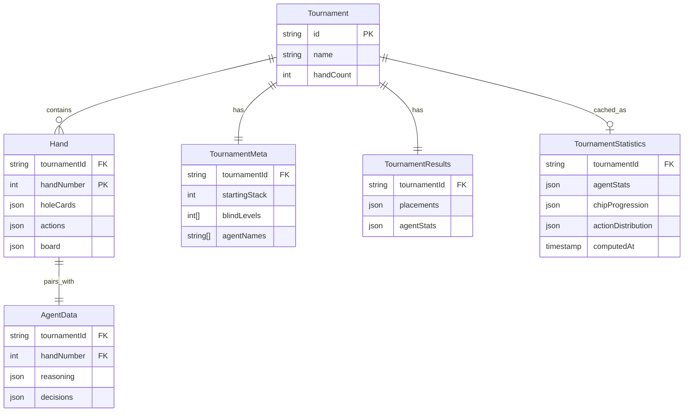

# Migration Plan: Vite + React to T3 Stack with tRPC Caching

**Created:** 2025-12-17
**Status:** Draft
**Complexity:** A LOT (Comprehensive Issue)

---

## Overview

Two-phase migration of the poker tournament replay application:

1. **Phase 1**: Port the existing Vite + React application (`/replay`) to the T3 stack (`/replay-t3`) using Next.js 15, tRPC 11, and TanStack Query
2. **Phase 2**: Move statistics computation from client-side to server-side with aggressive multi-layer caching

### Current Architecture

```
/replay (Vite + React)
├── React 19 + Vite 7
├── Zustand for all state
├── Static JSON files in /public/data/
├── Client-side statistics computation
└── Single-page app (no routing)
```

### Target Architecture

```
/replay-t3 (T3 Stack)
├── Next.js 15 App Router
├── tRPC 11 for API
├── TanStack Query 5 for client caching
├── Server-side statistics computation
├── Multi-layer caching (HTTP + server + client)
└── Proper URL routing with deep linking
```

---

## Problem Statement

### Current Issues

1. **Excessive HTTP Requests**: Loading statistics requires 100+ individual JSON file fetches per tournament, 300+ for overall statistics across all tournaments

2. **Wasted Client Computation**: Historical tournament data is immutable, yet statistics are recomputed on every page load in the user's browser

3. **No Deep Linking**: Single-page app with view switching via Zustand state means no shareable URLs for specific tournaments or hands

4. **Poor Caching**: Only session-scoped `useRef` caching; data lost on page refresh

### Business Value

- **Performance**: 10x faster statistics loading (1 request vs 100+)
- **Bandwidth**: Reduce client data transfer by 90%+ for statistics views
- **UX**: Shareable URLs, browser history navigation, faster perceived load times
- **Scalability**: Server-side caching supports growing tournament archive

---

## Technical Approach

### Phase 1: Application Migration

#### URL Structure

```
/                                    → Landing/tournament list
/replay/[tournamentId]               → Replay view (hand 1 default)
/replay/[tournamentId]/[handNumber]  → Specific hand
/summary/[tournamentId]              → Tournament statistics
/overall                             → Cross-tournament statistics
/about                               → About page
```

Query parameters for UI state:
- `?seat=3` - Selected seat
- `?frame=15` - Playback position (optional persistence)

#### State Management Split

**Stays in Zustand** (UI-only state):
- `isPlaying`, `playbackSpeed` - Playback controls
- `currentFrameIndex` - Animation frame
- `selectedSeat` - Currently viewed player
- `autoPlayEnabled` - User preference

**Moves to React Query** (via tRPC):
- Tournament metadata
- Hand data (hand + agent files)
- Statistics (pre-computed on server)

#### tRPC Router Structure

```typescript
// src/server/api/routers/tournament.ts
export const tournamentRouter = createTRPCRouter({
  list: publicProcedure.query(async () => {
    // Returns: string[] of tournament IDs
  }),

  getMeta: publicProcedure
    .input(z.object({ tournamentId: z.string() }))
    .query(async ({ input }) => {
      // Returns: TournamentMeta
    }),

  getResults: publicProcedure
    .input(z.object({ tournamentId: z.string() }))
    .query(async ({ input }) => {
      // Returns: TournamentResults
    }),

  getHand: publicProcedure
    .input(z.object({
      tournamentId: z.string(),
      handNumber: z.number()
    }))
    .query(async ({ input }) => {
      // Returns: { hand: HandData, agent: AgentData }
    }),
});

// src/server/api/routers/statistics.ts
export const statisticsRouter = createTRPCRouter({
  tournament: publicProcedure
    .input(z.object({ tournamentId: z.string() }))
    .query(async ({ input }) => {
      // Returns: TournamentStatistics (pre-computed)
    }),

  overall: publicProcedure.query(async () => {
    // Returns: OverallStatistics (pre-computed)
  }),
});
```

#### Component Migration Priority

| Priority | Component | Reason |
|----------|-----------|--------|
| 1 | `TopNavigation` | Simple, establishes routing pattern |
| 2 | `HandList` | Tests tRPC data fetching |
| 3 | `PokerTable` | Core visualization, uses playback state |
| 4 | `ReasoningPanel` | Depends on hand/agent data |
| 5 | `PlaybackControls` | Uses Zustand playback state |
| 6 | `TournamentSummary` | Tests statistics API |
| 7 | `OverallStatistics` | Final validation of caching |

---

### Phase 2: Server-Side Statistics & Caching

#### Data Location

Keep tournament JSON files in server-accessible location:
```
/replay-t3/data/
├── tournaments/
│   ├── tournament_001/
│   │   ├── meta.json
│   │   ├── results.json
│   │   └── hands/
│   │       ├── hand_001.json
│   │       └── agent_001.json
│   └── tournament_002/
│       └── ...
```

**NOT in `/public`** - served via tRPC only to enable caching.

#### Caching Architecture

```
┌─────────────────────────────────────────────────────────────┐
│                        USER REQUEST                          │
└─────────────────────────────────────────────────────────────┘
                              │
                              ▼
┌─────────────────────────────────────────────────────────────┐
│  LAYER 1: HTTP Cache Headers                                │
│  Cache-Control: public, max-age=31536000, immutable         │
│  (CDN/Browser cache for 1 year)                             │
└─────────────────────────────────────────────────────────────┘
                              │
                              ▼
┌─────────────────────────────────────────────────────────────┐
│  LAYER 2: React Query Client Cache                          │
│  staleTime: Infinity (immutable data)                       │
│  gcTime: 24 hours                                           │
└─────────────────────────────────────────────────────────────┘
                              │
                              ▼
┌─────────────────────────────────────────────────────────────┐
│  LAYER 3: Upstash Redis Cache                               │
│  Pre-computed statistics cached on first request            │
│  Never expires for immutable tournaments                    │
│  Persists across serverless cold starts                     │
└─────────────────────────────────────────────────────────────┘
                              │
                              ▼
┌─────────────────────────────────────────────────────────────┐
│  LAYER 4: File System (Source of Truth)                     │
│  Tournament JSON files in /data/tournaments/                │
└─────────────────────────────────────────────────────────────┘
```

#### Statistics Computation

**When**: First request (lazy computation + cache forever)

**Where**: Server-side in tRPC procedure

**Implementation**:

```typescript
// src/server/api/routers/statistics.ts
import { statisticsCache } from '~/server/cache';

export const statisticsRouter = createTRPCRouter({
  tournament: publicProcedure
    .input(z.object({ tournamentId: z.string() }))
    .query(async ({ input }) => {
      const cacheKey = `stats:${input.tournamentId}`;

      // Check cache first
      const cached = statisticsCache.get(cacheKey);
      if (cached) return cached;

      // Compute statistics (moved from client utils)
      const stats = await computeTournamentStatistics(input.tournamentId);

      // Cache forever (immutable data)
      statisticsCache.set(cacheKey, stats);

      return stats;
    }),
});
```

**Server Cache Implementation** (`src/server/cache.ts`) - Using Upstash Redis:

```typescript
import { Redis } from '@upstash/redis';

const redis = Redis.fromEnv();

export const statisticsCache = {
  get: async <T>(key: string): Promise<T | null> => {
    return await redis.get<T>(key);
  },
  set: async <T>(key: string, value: T): Promise<void> => {
    // No expiration for immutable tournament data
    await redis.set(key, value);
  },
  clear: async (): Promise<void> => {
    // Use with caution - clears all keys
    await redis.flushdb();
  },
};
```

#### HTTP Response Caching

```typescript
// src/server/api/routers/statistics.ts
import { TRPCError } from '@trpc/server';

// In tRPC context or middleware
export const statisticsRouter = createTRPCRouter({
  tournament: publicProcedure
    .input(z.object({ tournamentId: z.string() }))
    .query(async ({ input, ctx }) => {
      // Set cache headers for immutable data
      ctx.res?.setHeader(
        'Cache-Control',
        'public, max-age=31536000, immutable'
      );

      // ... computation logic
    }),
});
```

#### React Query Configuration

```typescript
// src/trpc/query-client.ts
export const createQueryClient = () =>
  new QueryClient({
    defaultOptions: {
      queries: {
        // For immutable tournament data
        staleTime: Infinity,
        gcTime: 1000 * 60 * 60 * 24, // 24 hours
        refetchOnWindowFocus: false,
        refetchOnMount: false,
        retry: 2,
      },
    },
  });
```

---

## Implementation Phases

### Phase 1: Foundation (Weeks 1-2)

#### Phase 1.1: Project Setup

- [ ] Copy shared types from `/replay/src/types/` to `/replay-t3/src/types/`
- [ ] Copy utility functions from `/replay/src/utils/` to `/replay-t3/src/utils/`
- [ ] Set up Tailwind with same configuration as `/replay`
- [ ] Install shared dependencies (recharts, react-window, zustand)

**Key Files:**
- `replay-t3/src/types/statistics.ts`
- `replay-t3/src/types/tournament.ts`
- `replay-t3/src/types/hand.ts`
- `replay-t3/src/types/agent.ts`

#### Phase 1.2: tRPC Routers

- [ ] Create `tournamentRouter` with `list`, `getMeta`, `getResults`, `getHand`
- [ ] Create data loading utilities (read JSON from filesystem)
- [ ] Add Zod schemas for all inputs
- [ ] Test API endpoints via tRPC panel

**Key Files:**
- `replay-t3/src/server/api/routers/tournament.ts`
- `replay-t3/src/server/data/loader.ts`

#### Phase 1.3: Zustand Store Migration

- [ ] Create minimal Zustand store for UI-only state
- [ ] Remove data fetching logic (handled by tRPC/React Query)
- [ ] Keep playback controls, selected seat, current frame

**Key Files:**
- `replay-t3/src/store/playbackStore.ts`

#### Phase 1.4: Basic Navigation

- [ ] Create layout with top navigation
- [ ] Implement route structure (`/replay/[tournamentId]`, etc.)
- [ ] Add tournament dropdown with tRPC data
- [ ] Implement view switching via routing

**Key Files:**
- `replay-t3/src/app/layout.tsx`
- `replay-t3/src/app/replay/[tournamentId]/page.tsx`
- `replay-t3/src/components/layout/TopNavigation.tsx`

### Phase 2: Core Migration (Weeks 3-4)

#### Phase 2.1: Poker Table & Replay

- [ ] Port `PokerTable` component tree
- [ ] Port `PlaybackControls` with Zustand integration
- [ ] Port `HandList` with tRPC data
- [ ] Port keyboard controls hook
- [ ] Port auto-play hook

**Key Files:**
- `replay-t3/src/components/table/PokerTable.tsx`
- `replay-t3/src/components/controls/PlaybackControls.tsx`
- `replay-t3/src/components/navigation/HandList.tsx`
- `replay-t3/src/hooks/useKeyboardControls.ts`
- `replay-t3/src/hooks/useAutoPlay.ts`

#### Phase 2.2: AI Reasoning Panel

- [ ] Port `ReasoningPanel` component
- [ ] Connect to hand/agent data from tRPC
- [ ] Ensure proper re-rendering on seat change

**Key Files:**
- `replay-t3/src/components/reasoning/ReasoningPanel.tsx`

#### Phase 2.3: Cards & Visual Components

- [ ] Port all card components
- [ ] Port chip visualizations
- [ ] Port action indicators
- [ ] Verify Tailwind styling matches original

**Key Files:**
- `replay-t3/src/components/cards/`
- `replay-t3/src/components/table/`

### Phase 3: Statistics & Caching (Weeks 5-6)

#### Phase 3.1: Statistics Router

- [ ] Create `statisticsRouter` with `tournament` and `overall` endpoints
- [ ] Move statistics computation to server (`tournamentStats.ts`, `crossTournamentStats.ts`)
- [ ] Implement server-side cache (Map-based)
- [ ] Add progress tracking for long computations

**Key Files:**
- `replay-t3/src/server/api/routers/statistics.ts`
- `replay-t3/src/server/statistics/tournamentStats.ts`
- `replay-t3/src/server/statistics/crossTournamentStats.ts`
- `replay-t3/src/server/cache.ts`

#### Phase 3.2: Statistics Views

- [ ] Port `TournamentSummary` component
- [ ] Port `OverallStatistics` component
- [ ] Connect to tRPC statistics endpoints
- [ ] Add loading states with skeleton UI

**Key Files:**
- `replay-t3/src/app/summary/[tournamentId]/page.tsx`
- `replay-t3/src/app/overall/page.tsx`
- `replay-t3/src/components/statistics/`

#### Phase 3.3: Caching Implementation

- [ ] Configure React Query for immutable data
- [ ] Add HTTP cache headers via tRPC middleware
- [ ] Test cache hit rates
- [ ] Implement cache warming on server start (optional)

**Key Files:**
- `replay-t3/src/trpc/query-client.ts`
- `replay-t3/src/server/api/trpc.ts` (middleware)

### Phase 4: Polish & Optimization (Week 7)

#### Phase 4.1: Data Migration

- [ ] Move tournament data from `/replay/public/data/` to `/replay-t3/data/`
- [ ] Update data loader to read from new location
- [ ] Verify all tournaments load correctly

#### Phase 4.2: Testing & Validation

- [ ] Compare statistics output between old and new implementations
- [ ] Performance benchmarking (load times, cache hit rates)
- [ ] Mobile responsiveness testing
- [ ] Browser compatibility testing

#### Phase 4.3: Cleanup

- [ ] Remove example T3 boilerplate code
- [ ] Update README with new architecture
- [ ] Document caching strategy
- [ ] Archive old `/replay` directory

---

## Acceptance Criteria

### Functional Requirements

- [ ] All four views work: Replay, Summary, Overall, About
- [ ] Tournament switching loads correct data
- [ ] Hand navigation works (prev/next/jump)
- [ ] Playback controls function (play/pause/speed/step)
- [ ] Keyboard shortcuts work (space, arrows)
- [ ] Statistics match original implementation values
- [ ] Deep linking works (shareable URLs)

### Non-Functional Requirements

- [ ] Statistics load in <500ms (vs current 5-10s)
- [ ] Initial page load <2s on 4G connection
- [ ] Cache hit rate >95% for returning users
- [ ] No memory leaks after 30+ min usage
- [ ] Works on mobile (iOS Safari, Chrome)

### Quality Gates

- [ ] TypeScript strict mode passes
- [ ] No console errors in production
- [ ] All tRPC procedures have Zod validation
- [ ] Statistics computation produces identical results to original

---

## Dependencies & Prerequisites

### Technical Dependencies

| Dependency | Version | Purpose |
|------------|---------|---------|
| Next.js | 15.2.3 | Framework |
| tRPC | 11.0.0 | API layer |
| TanStack Query | 5.69.0 | Client caching |
| Zustand | 5.0.9 | UI state |
| Recharts | 3.6.0 | Charts |
| react-window | 2.2.3 | Virtualization |
| Tailwind CSS | 4.0.15 | Styling |

### Data Dependencies

- Tournament JSON files in expected format
- Consistent schema across all tournaments
- At least one complete tournament for testing

### Knowledge Prerequisites

- Understanding of existing statistics calculation logic
- Familiarity with T3 stack patterns
- Understanding of tRPC procedures and React Query

---

## Risk Analysis & Mitigation

### Risk 1: Statistics Calculation Discrepancies

**Risk**: Server-side calculations differ from client-side
**Probability**: Medium
**Impact**: High (incorrect data)
**Mitigation**:
- Copy exact calculation logic without modification
- Create comparison tests between old and new implementations
- Validate with known tournament data

### Risk 2: Memory Usage for Large Tournament Sets

**Risk**: Server memory exhaustion with many cached statistics
**Probability**: Low (currently 3 tournaments)
**Impact**: Medium (server crash)
**Mitigation**:
- Monitor memory usage in production
- Implement LRU eviction if needed
- Consider Redis for large-scale caching

### Risk 3: Migration Takes Longer Than Expected

**Risk**: Scope creep or unforeseen complexity
**Probability**: Medium
**Impact**: Medium (delayed delivery)
**Mitigation**:
- Start with critical path (replay view)
- Keep old app running in parallel
- Defer nice-to-have features

### Risk 4: Breaking Changes in Dependencies

**Risk**: React 19, Next.js 15, or tRPC 11 have breaking changes
**Probability**: Low (already in use)
**Impact**: Low (workarounds available)
**Mitigation**:
- Lock dependency versions
- Test early and often
- Keep T3 boilerplate patterns

---

## Success Metrics

| Metric | Current | Target | How to Measure |
|--------|---------|--------|----------------|
| Statistics load time | 5-10s | <500ms | Performance.now() in browser |
| HTTP requests for Overall | 300+ | 1 | Network tab |
| Cache hit rate | 0% | >95% | React Query devtools |
| Bundle size | ~500KB | <600KB | Lighthouse |
| LCP (Largest Contentful Paint) | Unknown | <2.5s | Lighthouse |

---

## Future Considerations

### Potential Enhancements

1. **Real-time Tournament Updates**: WebSocket subscriptions for live tournaments
2. **User Preferences**: Save playback speed, preferred seat in localStorage
3. **Comparison Mode**: Side-by-side tournament comparison
4. **Export Features**: Download statistics as CSV/JSON
5. **Search**: Find specific hands by criteria

### Scalability

- Current: 3 tournaments, ~300 hands total
- Short-term: 10 tournaments, ~1000 hands
- Long-term: Consider database storage if >100 tournaments

### Technical Debt to Address

1. Move from Map cache to Redis for multi-instance deployments
2. Add E2E tests with Playwright
3. Implement proper error tracking (Sentry)
4. Add analytics for usage patterns

---

## References & Research

### Internal References

- `/replay/src/state/replayStore.ts` - Current Zustand store implementation
- `/replay/src/utils/statistics/tournamentStats.ts:31-58` - Statistics calculation logic
- `/replay/src/hooks/useStatistics.ts:10-54` - Current statistics hook
- `/replay-t3/src/server/api/trpc.ts:25-29` - T3 tRPC context setup
- `/replay-t3/src/trpc/react.tsx:41-72` - Client-side tRPC provider

### External References

- [Next.js Vite Migration Guide](https://nextjs.org/docs/app/guides/migrating/from-vite)
- [T3 Stack Documentation](https://create.t3.gg/en/introduction)
- [tRPC Caching Documentation](https://trpc.io/docs/server/caching)
- [TanStack Query Caching](https://tanstack.com/query/latest/docs/framework/react/guides/caching)
- [WorkOS Zero Downtime Migration](https://workos.com/blog/migrating-to-next-js-app-router-with-zero-downtime)

### Related Work

- `/replay-t3/src/server/api/routers/post.ts` - Example tRPC router pattern
- `/replay-t3/src/app/page.tsx` - Example server component with tRPC

---

## ERD: Data Model



---

## Decisions Made

1. **Data File Location**: Move tournament data immediately to `/replay-t3/data/` - all changes happen in this migration

2. **URL Persistence**: Hand number only in URL (`/replay/[tournamentId]/[handNumber]`), frame index stays in Zustand

3. **Mobile Support**: **Desktop only**. Display a "Only available on desktop" page when screen dimensions are too small (< 1024px width)

4. **Cache Invalidation**: Manual cache clear when new tournament added (acceptable for current scale)

5. **Error Handling**: Show partial data with warning for missing hands
